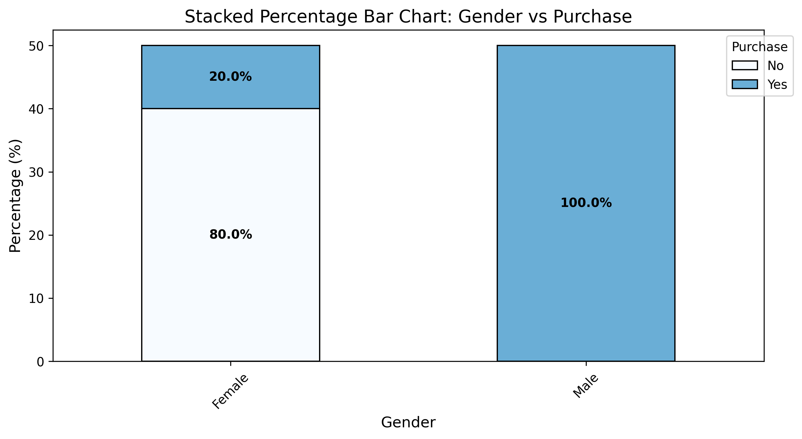

# 📊 Statistical Analysis: `Gender` vs `Purchase`

## 1️⃣ Chi-Square Test for Independence
- **Chi-Square Statistic**: 3.7500
- **p-value**: 5.2808e-02
- **Degrees of Freedom**: 1

**Conclusion:** No significant relationship between `Gender` and `Purchase` (p-value > 0.05).

## 2️⃣ Cramér’s V (Strength of Association)
- **Cramér’s V**: 0.6124

🔹 **Conclusion:** The association is **strong**.

## 3️⃣ Visualization

